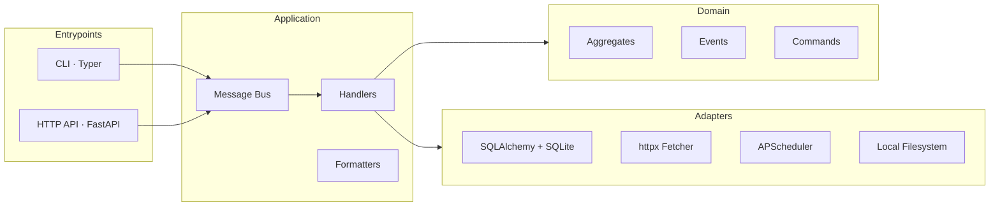

# allowy

Periodically syncs IP ranges from upstream providers and generates ready-to-use allowlist configs for nginx, Traefik, and raw CIDR formats.


[](https://github.com/0xmillennium/allowy/actions/workflows/ci.yml)


## Why

Reverse proxies and firewalls need IP allowlists for crawler verification, CDN trust, and service-to-service access control. Upstream providers like Google publish these ranges in different formats, and they change without notice. Manually maintaining allowlists drifts out of date, breaks configs, and doesn't scale across multiple sources. allowy automates the fetch-parse-generate cycle on a configurable schedule so your configs stay current.

## Quick Start

**Docker (recommended):**

```bash
git clone <repo-url> && cd allowy
docker compose up
```

**From source:**

```bash
git clone <repo-url> && cd allowy
python -m venv .venv && source .venv/bin/activate
pip install -e .
allowy serve
```

Then in another terminal:

```bash
allowy init run          # seed sources from config and trigger first sync
allowy config nginx      # view generated nginx allowlist
```

The service is available at `http://localhost:8000`. Interactive API docs are at `/docs`.

## Installation

### From Source

**Prerequisites:** Python >= 3.11

```bash
python -m venv .venv && source .venv/bin/activate
pip install -e .
allowy version           # verify installation
```

For development:

```bash
pip install -e ".[dev]"
```

### Docker

```bash
docker compose up --build
```

See the [Docker](#docker) section for details on volumes, environment, and production usage.

## Configuration

### Environment Variables

All variables can be set via a `.env` file in the project root. Defaults work out of the box.

| Variable | Description | Default |
|---|---|---|
| `DATABASE_URL` | SQLAlchemy async database URL | `sqlite+aiosqlite:///./config/database.db` |
| `OUTPUT_DIR` | Directory for generated config files | `./outputs` |
| `SCHEDULER_TIMEZONE` | Timezone for the sync scheduler | `UTC` |
| `SERVER_PORT` | HTTP server bind port | `8000` |
| `HTTP_TIMEOUT` | Timeout (seconds) for upstream HTTP requests | `30` |
| `LOG_CONFIG_PATH` | Path to Python logging YAML config | `./config/logging.yaml` |
| `SEED_SOURCES_PATH` | Path to seed sources YAML file | `./config/sources.yaml` |

### Sources (`config/sources.yaml`)

This is the primary configuration file. It defines which upstream IP range endpoints to sync:

```yaml
sources:
  - name: "Google Common Crawlers"
    url: "https://developers.google.com/static/search/apis/ipranges/googlebot.json"
    source_type: "google"
    sync_interval: 5

  - name: "Google Special Crawlers"
    url: "https://developers.google.com/static/search/apis/ipranges/special-crawlers.json"
    source_type: "google"
    sync_interval: 5

  - name: "Google User Triggered Fetchers"
    url: "https://developers.google.com/static/search/apis/ipranges/user-triggered-fetchers-google.json"
    source_type: "google"
    sync_interval: 5
```

| Field | Description |
|---|---|
| `name` | Human-readable label (1–100 characters) |
| `url` | HTTPS URL to the upstream IP range endpoint |
| `source_type` | Parser key — must match a registered parser (currently: `google`) |
| `sync_interval` | Minutes between syncs (minimum: 5) |

### Logging

Logging is configured via `config/logging.yaml` using Python's standard [dictConfig](https://docs.python.org/3/library/logging.config.html#logging-config-dictschema) format. Defaults to console output and a rotating JSON file at `logs/app.log`.

## Usage

### Managing Sources

```bash
# List all sources
allowy source list

# Add a new source
allowy source create \
  --name "Google Special Crawlers" \
  --url "https://developers.google.com/static/search/apis/ipranges/special-crawlers.json" \
  --type google \
  --interval 10

# Pause all syncs during maintenance
allowy source pause-all

# Resume all syncs
allowy source resume-all

# Delete a source
allowy source delete <source-id>
```

### Triggering a Sync

```bash
allowy sync trigger <source-id>
```

### Retrieving Generated Configs

```bash
allowy config nginx      # nginx allow/deny directives
allowy config traefik    # Traefik ipWhiteList middleware YAML
allowy config raw        # plain CIDR list, one per line
```

### HTTP API

```bash
# List all sources
curl http://localhost:8000/ip-sources

# Trigger a sync
curl -X POST http://localhost:8000/sync/<source-id>

# Get the nginx config
curl http://localhost:8000/configs/nginx
```

### Output Formats

**nginx.conf** — `allow` directives with a trailing `deny all`:

```nginx
# IPv4
allow 66.249.70.224/27;
allow 66.249.65.0/27;
allow 66.102.8.224/27;
...

deny all;
```

**traefik.yml** — Traefik middleware `ipWhiteList` configuration:

```yaml
http:
  middlewares:
    google-ip-whitelist:
      ipWhiteList:
        sourceRange:
          # IPv4
          - "66.249.70.224/27"
          - "66.249.65.0/27"
          ...
```

**raw.txt** — plain CIDR blocks, one per line:

```
# IPv4
66.249.70.224/27
66.249.65.0/27
66.102.8.224/27
...
```

## Architecture

allowy follows hexagonal (ports and adapters) architecture:



| Directory | Responsibility |
|---|---|
| `src/domain/` | Aggregates, value objects, events, commands — no framework dependencies |
| `src/core/ports/` | Abstract interfaces (repository, fetcher, parser, scheduler, etc.) |
| `src/application/` | Command/event handlers, formatters, message bus, views |
| `src/adapters/` | Concrete implementations (SQLAlchemy, httpx, APScheduler, filesystem) |
| `src/entrypoints/` | HTTP routes (FastAPI) and CLI commands (Typer) |

## API Reference

The HTTP API is documented via OpenAPI. Once the server is running:

- **Swagger UI:** [http://localhost:8000/docs](http://localhost:8000/docs)
- **ReDoc:** [http://localhost:8000/redoc](http://localhost:8000/redoc)

Route groups:

| Prefix | Description |
|---|---|
| `/health/*` | Liveness and readiness probes |
| `/ip-sources/*` | CRUD and lifecycle management for IP sources |
| `/sync/*` | Manually trigger a sync |
| `/configs/*` | Retrieve generated allowlist configs |
| `/initialize` | Seed sources from config and run initial sync |

## Docker

### Running

```bash
# Build and start
docker compose up --build

# Detached mode
docker compose up -d

# View logs
docker compose logs -f
```

### Volumes

The container mounts three directories from the host:

| Host Path | Container Path | Purpose |
|---|---|---|
| `./config/` | `/app/config/` | Sources YAML, logging config, SQLite database |
| `./outputs/` | `/app/outputs/` | Generated nginx, Traefik, and raw config files |
| `./logs/` | `/app/logs/` | Application log files |

### Environment

Environment variables are loaded from `.env`. Override any setting:

```bash
SERVER_PORT=9000 docker compose up
```

### Startup Sequence

The [`entrypoint.sh`](entrypoint.sh) handles startup:

1. Starts the HTTP server in the background
2. Waits for the health check to pass
3. Runs `allowy init run` to seed sources and trigger the first sync

## Contributing

### Running Tests

```bash
pip install -e ".[dev]"
pytest                    # all tests
pytest tests/unit         # unit only
pytest tests/integration  # integration only
pytest tests/e2e          # end-to-end only
```

### Linting and Type Checking

```bash
ruff check src/ tests/
ruff format --check src/ tests/
mypy src/
```

### CI/CD

CI runs automatically on PRs to `master` and pushes to `master` via GitHub Actions:

- **Quality:** ruff lint, ruff format, mypy, pip-audit
- **Tests:** unit, integration, e2e with 80% coverage gate
- **Docker:** build validation on `master` pushes
- **Matrix:** Python 3.11, 3.12, 3.13

CD triggers on version tags (`v*.*.*`) — builds and pushes to GHCR.

### Adding a New Parser

To add support for a new provider (e.g., Cloudflare):

1. **Create the parser** at `src/adapters/fetcher/parsers/cloudflare.py`:

   ```python
   from src.core.ports.parser import AbstractResponseParser
   from src.domain.value_objects import CIDRBlock

   class CloudflareTextParser(AbstractResponseParser):
       def parse(self, data: bytes) -> list[CIDRBlock]:
           blocks = []
           for line in data.decode().strip().splitlines():
               line = line.strip()
               if line:
                   blocks.append(CIDRBlock(value=line))
           return blocks
   ```

2. **Register it** in `src/adapters/fetcher/parsers/__init__.py`:

   ```python
   from src.adapters.fetcher.parsers.cloudflare import CloudflareTextParser

   PARSERS["cloudflare"] = CloudflareTextParser()
   ```

3. **Add a source** in `config/sources.yaml`:

   ```yaml
   - name: "Cloudflare IPv4"
     url: "https://www.cloudflare.com/ips-v4/"
     source_type: "cloudflare"
     sync_interval: 60
   ```

4. **Write tests** following the patterns in `tests/unit/adapters/`.

See [`src/adapters/fetcher/parsers/google.py`](src/adapters/fetcher/parsers/google.py) as a reference implementation.

## Known Limitations

- Only the `google` parser is implemented — no Cloudflare, AWS, or other providers yet
- Only tested with SQLite — other SQLAlchemy-compatible async backends (e.g., PostgreSQL with asyncpg) should work but are untested
- No authentication on the HTTP API — do not expose publicly without a reverse proxy or firewall
- Single-node only — APScheduler runs in-process with no distributed locking

## License

This project is licensed under the [MIT License](LICENSE).
